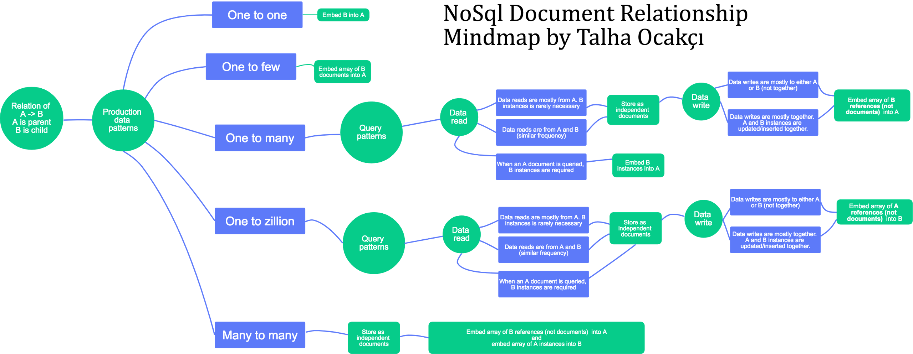

# Csw Tech Unit Cassandra

## Using Cassandra + Docker

### Run Docker

```bash
docker run --name some-cassandra -p 9042:9042 -p 9160:9160 -d cassandra:latest 
```

### Run CQL SH
>  CQL — Cassandra Query Language

```bash
docker exec -it some-cassandra cqlsh
```

### Run cqlsh commands

```sql
CREATE KEYSPACE IF NOT EXISTS cswKeyspace WITH REPLICATION = {'class':'SimpleStrategy', 'replication_factor':1};

CREATE TABLE cswkeyspace.order_status ( id UUID PRIMARY KEY, status text );

INSERT INTO cswkeyspace.order_status (id, status) VALUES (now(), 'New');
INSERT INTO cswkeyspace.order_status (id, status) VALUES (now(), 'In Progress');
INSERT INTO cswkeyspace.order_status (id, status) VALUES (now(), 'Shipped');
INSERT INTO cswkeyspace.order_status (id, status) VALUES (now(), 'In Delivery');
INSERT INTO cswkeyspace.order_status (id, status) VALUES (now(), 'Delivered');

```


### Others

```bash
docker inspect some-cassandra
docker exec -it some-cassandra nodetool status
```

```sql
USE cswKeyspace;
DROP TABLE cswkeyspace.order_status;
```

```bash
docker exec -it some-cassandra /bin/bash
```

> The Cassandra configuration files can be found in the conf directory of tarballs. For packages, the configuration files will be located in /etc/cassandra.

***
###  What is Apache Cassandra?
> Apache Cassandra™, a top level Apache project born at Facebook and built on Amazon’s Dynamo and Google’s BigTable, is a distributed database for managing large amounts of structured data across many commodity servers, while providing highly available service and no single point of failure. 

### How to set up entity relations?

1. **Embedding** the referred document

2. Just putting the key of the referred document and storing the referred document independently. If the cardinality is something like 1 to 10000 ( **one to zillion**) reference storing should be done vice versa.

3. Using an intermediate document for relations if the cardinality is many to many.



### Links
* https://bitbucket.critical.pt/projects/ALCHEMISTSTRAINING/repos/techunits/browse/techunits/cassandra.md
* https://medium.com/@zwinny/cassandra-with-docker-915153e0592c
* https://github.com/datastax/csharp-driver
* https://medium.com/@talhaocakci/redesigning-persistence-entities-for-nosql-ebfd74a23de5
